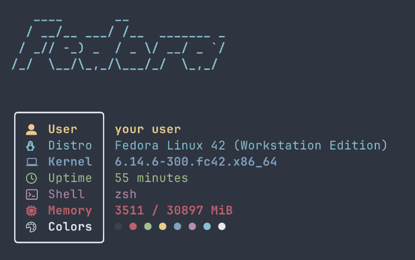

# DravFetch

**DravFetch** is a stylish, minimal fetch tool for Linux written in Bash. It shows your system info in a clean, colorized box with distro-colored ASCII art
to be honest its just nitch

---

##  Dependencies

- `bash`
- `figlet`
- A Nerd Font installed and configured in your terminal (e.g., [Nerd Fonts](https://www.nerdfonts.com/))

---


##  Features

-  Distro-colored ASCII art via `figlet`
-  User, Distro, Kernel, Uptime. Shell, and Memory info
-  Color preview line
-  Lightweight (pure Bash + figlet)

##  Preview



---

##  Installation

###  Quick Install

Paste this in your terminal:

```bash
bash <(curl -sSL https://raw.githubusercontent.com/Dravilias/DravFetch/main/install.sh)
```
## Inspiration came from 

https://github.com/ssleert/nitch
